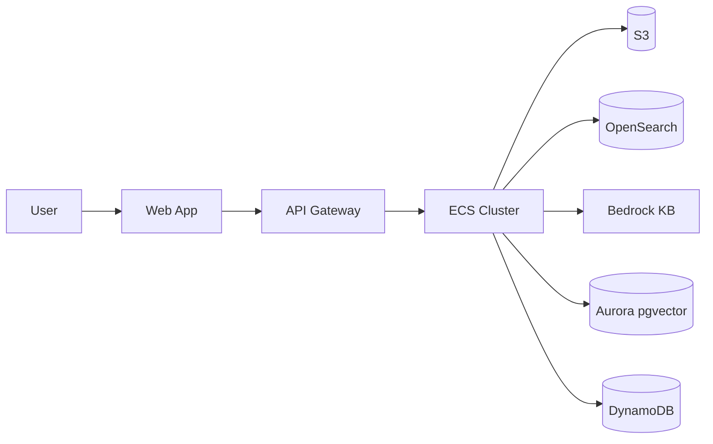
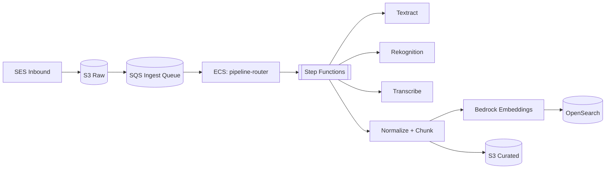
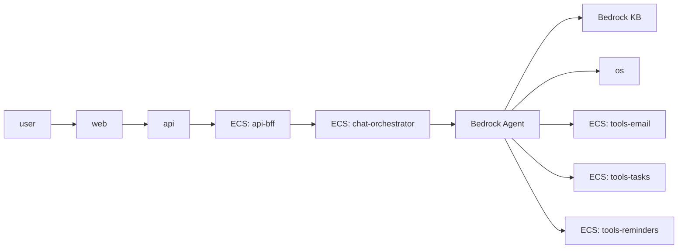
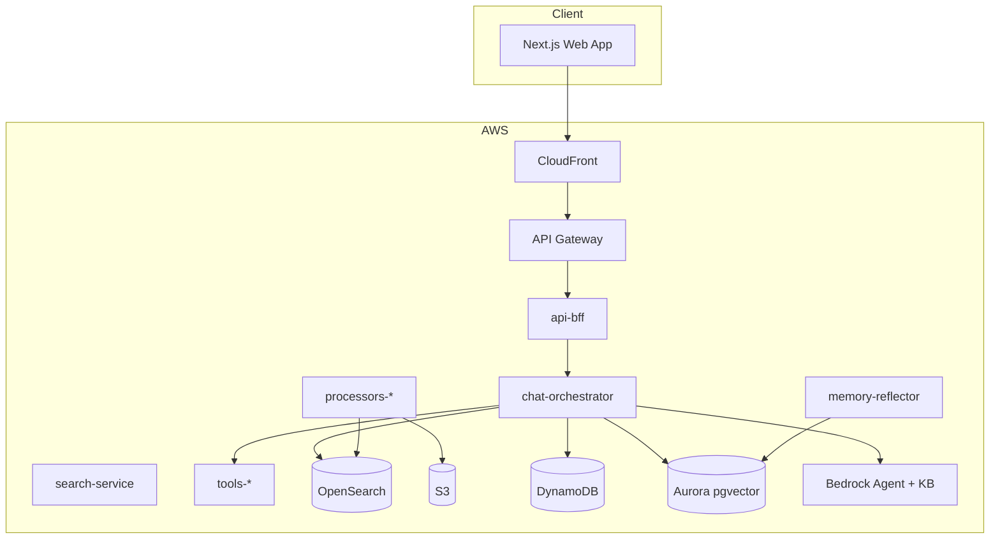
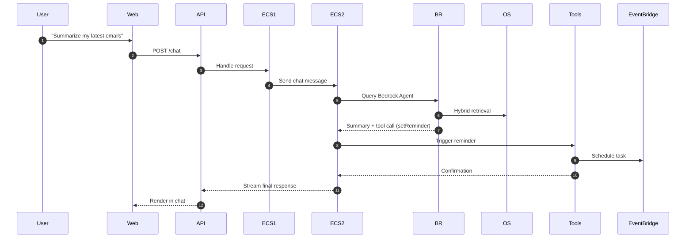

# 🧠 Jarvis — Personal AI Assistant on AWS Fargate
> A secure, self-hosted, auto-scaling AI assistant that connects to your personal data — emails, photos, files, and more — entirely within your AWS account.


---

## 🌍 Vision

Jarvis is your personal AI assistant — a **web-based, private, and continuously learning** agent that lives entirely inside AWS.

It can read your emails, photos, and documents (securely), answer questions, summarize information, and perform tasks — from setting reminders to drafting emails — all through chat. Over time, it learns your preferences and becomes smarter.

---

## ⚙️ Core Capabilities

| Function | Description | AWS Services |
|-----------|--------------|---------------|
| **Data Intake** | Pull in your emails, texts, files, and photos | SES, S3, SQS |
| **Data Understanding** | OCR, transcription, NLP, and vision analysis | Textract, Transcribe, Comprehend, Rekognition |
| **Knowledge Search (RAG)** | Retrieve and reason over your data | Bedrock Knowledge Base, OpenSearch Serverless |
| **Chat Assistant** | Conversational interface and task orchestrator | Bedrock Agent, ECS (chat-orchestrator), API Gateway |
| **Memory + Learning** | Stores and summarizes insights over time | Aurora pgvector, DynamoDB |
| **Action System** | Sends emails, creates reminders, automates tasks | SES, EventBridge, DynamoDB |
| **Security & Privacy** | End-to-end encryption and compliance | KMS, IAM, Macie, GuardDuty |

---

## 🧩 Architecture Overview

<details>
<summary><b>Click to expand architecture diagram</b></summary>

```mermaid
flowchart LR
  user[User (Browser/Mobile)] --> ui[Web App (CloudFront + S3, Cognito)]
  ui --> api[API Gateway (HTTP/WS)]
  api --> ecs[ECS Cluster (Fargate Services)]

  subgraph DataPlane[Data / Knowledge Stores]
    kb[Bedrock Knowledge Base]
    os[(OpenSearch Serverless)]
    aur[(Aurora pgvector)]
    ddb[(DynamoDB)]
  end

  ecs --> kb
  ecs --> os
  ecs --> aur
  ecs --> ddb

  subgraph Ingestion[Ingestion Pipeline]
    s3[(S3 Raw + Curated)] --> sqs[SQS Queue]
    sqs --> sfn[Step Functions Orchestrator]
  end

  sfn --> ecs
```
</details>

---

## 🧱 ECS Fargate Services

| Service | Role | Scaling Type |
|----------|------|--------------|
| `api-bff` | WebSocket + REST broker | Always-on (target tracking) |
| `chat-orchestrator` | LLM Gateway → Bedrock Agent | Always-on |
| `search-service` | OpenSearch hybrid search | Always-on |
| `tools-email` | Draft & send emails | On-demand |
| `tools-tasks` | Manage to-do tasks | On-demand |
| `tools-reminders` | Create reminders | On-demand |
| `pipeline-router` | Routes S3 → Step Functions | Queue scaling |
| `processor-*` | Textract, Rekognition, Transcribe, Embed, Index | Queue scaling |
| `memory-reflector` | Nightly memory summarization | Scheduled |

---

## 🧠 Data Flow Diagrams

### Level 0 — Context



### Level 1 — Ingestion



### Level 1 — Chat & Actions



---

## 🧩 UML Diagrams

### Component Diagram



### Sequence — “Summarize emails + reminder”



### Deployment Diagram

```mermaid
graph TB
  Browser --> CF[CloudFront]
  CF --> APIGW[API Gateway]
  APIGW --> NLB[Internal NLB]
  NLB --> ECS[ECS Cluster (Private Subnets)]
  ECS --> S3[(S3)]
  ECS --> OS[(OpenSearch)]
  ECS --> DDB[(DynamoDB)]
  ECS --> AUR[(Aurora pgvector)]
  ECS --> BR[Bedrock Agent]
```

---

## 🧰 DevOps + Scaling

| Layer | Tech | Notes |
|-------|------|-------|
| IaC | AWS CDK (TypeScript) | Define all infra declaratively |
| CI/CD | GitHub Actions + CodePipeline | Build Docker + Deploy ECS/CDK |
| Monitoring | CloudWatch + X-Ray + OTEL | Metrics & traces |
| Scaling | TargetTracking + StepScaling | Based on CPU, Memory, or SQS depth |
| Secrets | AWS Secrets Manager | Encrypted env vars |
| Network | Private VPC + Endpoints | No public access |

---

## 🔐 Security

- KMS encryption for all storage layers  
- IAM least privilege roles per ECS task  
- Macie & GuardDuty for ongoing compliance  
- CloudTrail for audit logging  
- API Gateway WAF for DDoS & abuse protection  
- User-facing “Delete My Data” and “Export My Data” options

---

## ⚡ PowerShell Deployment Workflow

```powershell
pwsh scripts/Setup-AwsProfile.ps1
pwsh scripts/Create-Ecr-Repos.ps1
pwsh scripts/Build-Push-All.ps1 -Tag sha-xxxx
pwsh scripts/Deploy-Cdk.ps1
pwsh scripts/Update-Ecs-Services.ps1 -Tag sha-xxxx
```

Scripts included:
- `Setup-AwsProfile.ps1`
- `Create-Ecr-Repos.ps1`
- `Build-Push-All.ps1`
- `Deploy-Cdk.ps1`
- `Update-Ecs-Services.ps1`
- `Scale-Workers.ps1`
- `Rollback-Service.ps1`
- `Seed-Fixtures.ps1`

---

## 🧠 Roadmap

- ✅ Text-based assistant MVP  
- 🔄 Voice + multimodal (audio & image) support  
- 📆 Calendar and productivity integrations  
- 🧩 Personalized Bedrock fine-tuning  
- 🪄 Smart Home / IoT commands  

---

## 🧾 License
MIT © 2025 [SIQstack](https://siqstack.com)

---

*Generated on 2025-10-06 — AWS-native design by Franco Presta*
