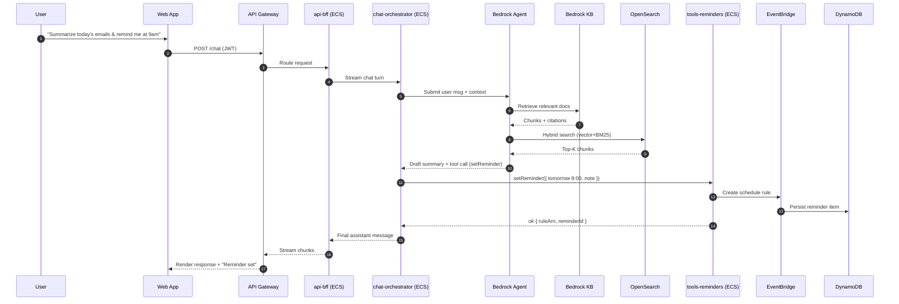
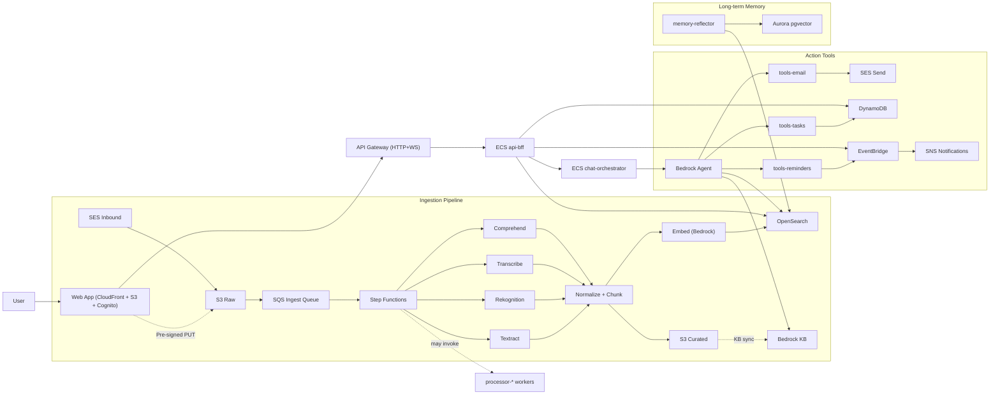
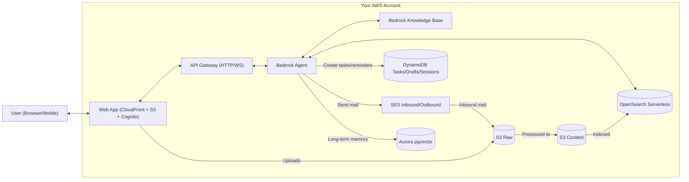
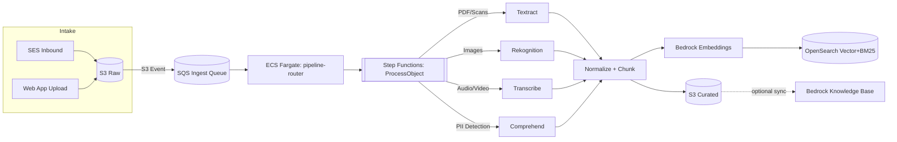
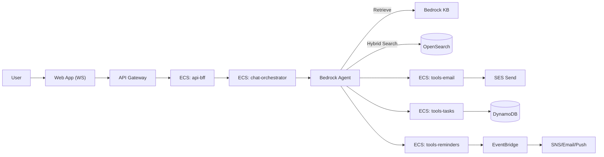
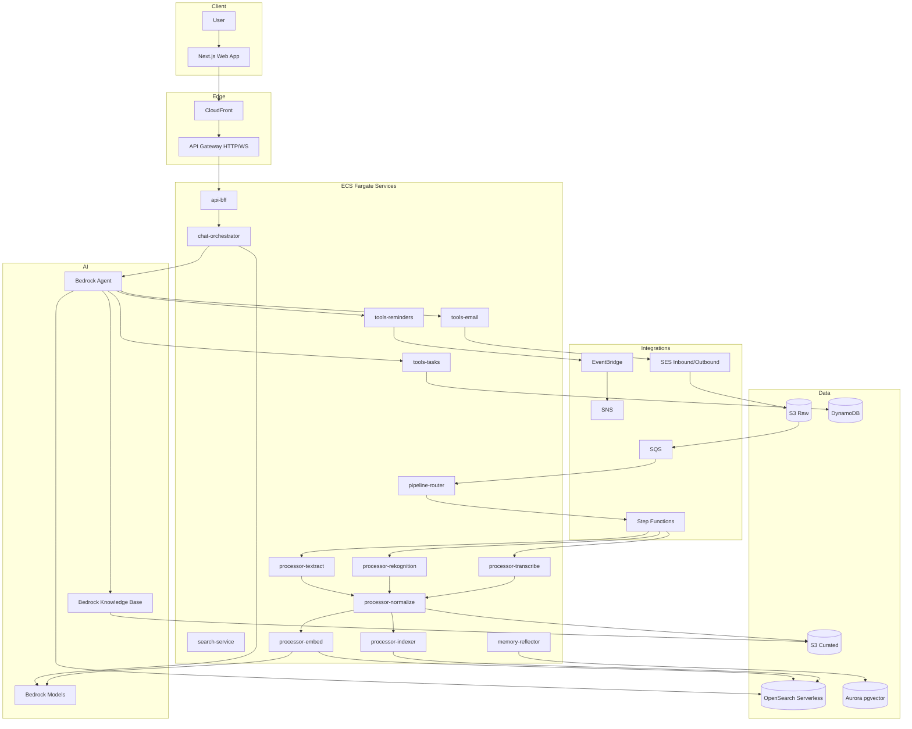
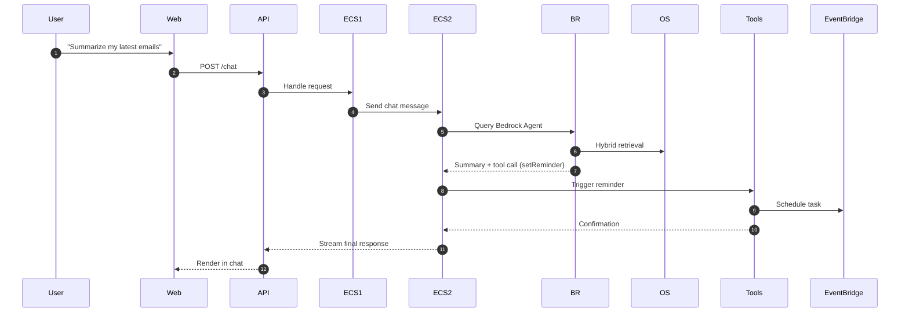
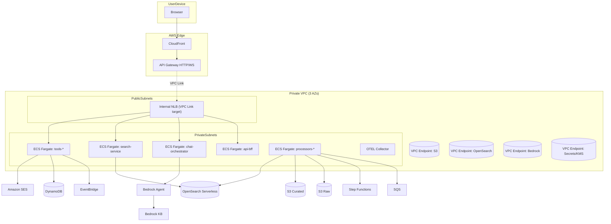
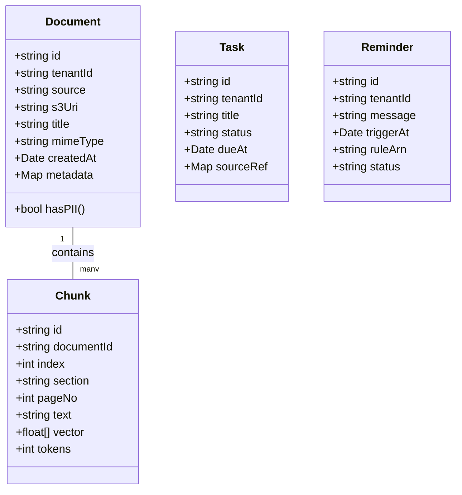

# 🧠 Jarvis — Personal AI Assistant on AWS Fargate
> A secure, self-hosted, auto-scaling AI assistant that connects to your personal data — emails, photos, files, and more




---

## 🌍 Vision

Jarvis is your personal AI assistant — a **web-based, private, and continuously learning** agent that lives entirely inside AWS.

It can read your emails, photos, and documents (securely), answer questions, summarize information, and perform tasks — from setting reminders to drafting emails — all through chat. Over time, it learns your preferences and becomes smarter.

---

## ⚙️ Core Capabilities

| Function | Description | AWS Services |
|-----------|--------------|---------------|
| **Data Intake** | Pull in your emails, texts, files, and photos | SES, S3, SQS |
| **Data Understanding** | OCR, transcription, NLP, and vision analysis | Textract, Transcribe, Comprehend, Rekognition |
| **Knowledge Search (RAG)** | Retrieve and reason over your data | Bedrock Knowledge Base, OpenSearch Serverless |
| **Chat Assistant** | Conversational interface and task orchestrator | Bedrock Agent, ECS (chat-orchestrator), API Gateway |
| **Memory + Learning** | Stores and summarizes insights over time | Aurora pgvector, DynamoDB |
| **Action System** | Sends emails, creates reminders, automates tasks | SES, EventBridge, DynamoDB |
| **Security & Privacy** | End-to-end encryption and compliance | KMS, IAM, Macie, GuardDuty |

---

## 🧩 Architecture Overview

<details>
<summary><b>Click to expand architecture diagram</b></summary>


</details>

| Service | Role | Scaling Type |
|----------|------|--------------|
| `api-bff` | WebSocket + REST broker | Always-on (target tracking) |
| `chat-orchestrator` | LLM Gateway → Bedrock Agent | Always-on |
| `search-service` | OpenSearch hybrid search | Always-on |
| `tools-email` | Draft & send emails | On-demand |
| `tools-tasks` | Manage to-do tasks | On-demand |
| `tools-reminders` | Create reminders | On-demand |
| `pipeline-router` | Routes S3 → Step Functions | Queue scaling |
| `processor-*` | Textract, Rekognition, Transcribe, Embed, Index | Queue scaling |
| `memory-reflector` | Nightly memory summarization | Scheduled |

---

## 🧠 Data Flow Diagrams

### Level 0 — Context



### Level 1 — Ingestion



### Level 1 — Chat & Actions



---

## 🧩 UML Diagrams

### Component Diagram



### Sequence — “Summarize emails + reminder”



### Deployment Diagram



### Data Models (Core Classes)



---

## 📁 Repository Structure

```
jarvis-assistant/
├─ README.md
├─ .env.example
├─ package.json
├─ pnpm-workspace.yaml
├─ turbo.json
├─ docker-compose.dev.yml
├─ .gitignore
│
├─ apps/
│  ├─ web/                          # Next.js (App Router) UI, Cognito auth
│  │  ├─ app/                       # routes: /chat, /search, /uploads, /settings
│  │  ├─ components/                # MessageStream, ResultCard, DraftModal, PiiBadge
│  │  ├─ lib/                       # cognito client, api fetchers, websocket client
│  │  ├─ public/
│  │  ├─ next.config.js
│  │  ├─ Dockerfile
│  │  └─ .env.local.example
│  │
│  └─ docs/                         # Architecture & runbooks
│     └─ architecture/*.md
│
├─ services/
│  ├─ api-bff/                      # Gateway → NLB → ECS (REST + WS broker)
│  │  ├─ src/
│  │  │  ├─ index.ts
│  │  │  ├─ routes/                 # /chat, /search, /actions/*
│  │  │  ├─ ws/                     # websocket upgrade handling
│  │  │  ├─ middleware/             # auth (Cognito JWT), rate limit, logging
│  │  │  └─ adapters/               # Bedrock Agent proxy, tool dispatch
│  │  ├─ Dockerfile
│  │  └─ .env.example
│  │
│  ├─ chat-orchestrator/            # Bedrock Agent gateway; streams tokens
│  │  ├─ src/
│  │  ├─ Dockerfile
│  │  └─ .env.example
│  │
│  ├─ search-service/               # Hybrid retrieval: OpenSearch (vector+BM25)
│  │  ├─ src/
│  │  │  ├─ handlers/search.ts
│  │  │  ├─ scoring/hybrid.ts
│  │  │  └─ mappings/               # OS index templates
│  │  ├─ Dockerfile
│  │  └─ .env.example
│  │
│  ├─ tools-email/                  # Draft + Send via SES
│  ├─ tools-tasks/                  # Create/list tasks (DynamoDB)
│  ├─ tools-reminders/              # Reminders (EventBridge → SNS)
│  ├─ ingest-ses-consumer/          # SES inbound S3 events → SQS
│  ├─ pipeline-router/              # SQS worker: detect type → Step Functions
│  ├─ processor-textract/           # Textract jobs for PDFs/scans
│  ├─ processor-rekognition/        # Labels, OCR-in-image
│  ├─ processor-transcribe/         # A/V transcription
│  ├─ processor-normalize/          # Canonical doc JSON + chunking
│  ├─ processor-embed/              # Bedrock embeddings (Titan/Cohere)
│  ├─ processor-indexer/            # Upsert to OpenSearch
│  ├─ memory-reflector/             # Nightly summarization + memory vectors
│  ├─ notifications/                # Server → client events (WS/SNS)
│  └─ otel-collector/               # OpenTelemetry collector
│
├─ infra/                           # AWS CDK (TypeScript) — Fargate-first
│  ├─ bin/
│  │  └─ cdk.ts
│  ├─ stacks/
│  │  ├─ network.ts                 # VPC, subnets, NAT, VPC endpoints
│  │  ├─ ecr.ts                     # ECR repos for each service
│  │  ├─ ecs-cluster.ts             # ECS Cluster, capacity providers
│  │  ├─ load-balancers.ts          # Internal NLB/ALB, target groups
│  │  ├─ api-gateway.ts             # HTTP API + VPC Link → NLB
│  │  ├─ identity.ts                # Cognito UserPool/Clients
│  │  ├─ storage.ts                 # S3 (raw/curated), KMS keys
│  │  ├─ search.ts                  # OpenSearch Serverless
│  │  ├─ data.ts                    # DynamoDB, optional Aurora pgvector
│  │  ├─ messaging.ts               # SQS queues, SNS topics
│  │  ├─ pipeline.ts                # Step Functions state machines
│  │  ├─ ses.ts                     # SES inbound rule set → S3
│  │  ├─ services.ts                # ECS TaskDefs, Services, AutoScaling
│  │  ├─ observability.ts           # CloudWatch dashboards/alarms, X-Ray
│  │  └─ security.ts                # IAM roles, WAF, GuardDuty, Macie
│  ├─ config/
│  │  ├─ dev.json
│  │  ├─ stg.json
│  │  └─ prod.json
│  └─ cdk.json
│
├─ packages/
│  ├─ clients/                      # Thin AWS SDK wrappers
│  ├─ prompts/                      # System + tool prompts (versioned)
│  ├─ shared-types/                 # Zod/TS types: Document, Chunk, Tool IO
│  ├─ security/                     # KMS helpers, PII maskers
│  └─ telemetry/                    # Logger, metrics, OpenTelemetry config
│
├─ openapi/
│  ├─ api.yaml                      # /chat, /search, /actions/* contract
│  └─ examples/*.json
│
├─ stepfunctions/
│  └─ process_object.asl.json
│
├─ scripts/
│  ├─ config.services.json          # Shared service definitions
│  ├─ Setup-AwsProfile.ps1
│  ├─ Create-Ecr-Repos.ps1
│  ├─ Build-Push-All.ps1
│  ├─ Deploy-Cdk.ps1
│  ├─ Update-Ecs-Services.ps1
│  ├─ Scale-Workers.ps1
│  ├─ Rollback-Service.ps1
│  ├─ Seed-Fixtures.ps1
│  └─ Smoke-Test.ps1
│
├─ .github/
│  └─ workflows/
│     ├─ ci.yml                     # lint/typecheck/test
│     ├─ build-and-push.yml         # build images → ECR (matrix)
│     └─ deploy-cdk.yml             # CDK synth/deploy via GitHub OIDC
│
└─ test/
   ├─ unit/                         # services/* unit tests
   ├─ contract/                     # OpenAPI contract tests
   ├─ integration/                  # local compose → hit endpoints
   └─ e2e/                          # provision ephemeral env → run flows
```

**Key Decisions:**
- **Everything backend = containers**: Each microservice is a small Node/TS service with single responsibility and its own ECS Task Definition
- **Ingress pattern**: API Gateway (HTTP) → VPC Link → Internal NLB → ECS Services (private subnets)
- **Auto-scaling**: Target Tracking (CPU/MEM), Step Scaling (SQS queue depth), RPS scaling via ALB/NLB metrics
- **Long tasks = on-demand workers**: Pipeline services scale with SQS depth and terminate when idle
- **Observability**: Central OTEL collector sends traces/metrics/logs to CloudWatch/X-Ray

---

## 🧰 DevOps + Scaling

| Layer | Tech | Notes |
|-------|------|-------|
| IaC | AWS CDK (TypeScript) | Define all infra declaratively |
| CI/CD | GitHub Actions + CodePipeline | Build Docker + Deploy ECS/CDK |
| Monitoring | CloudWatch + X-Ray + OTEL | Metrics & traces |
| Scaling | TargetTracking + StepScaling | Based on CPU, Memory, or SQS depth |
| Secrets | AWS Secrets Manager | Encrypted env vars |
| Network | Private VPC + Endpoints | No public access |

### ECS Fargate Scaling Patterns

| Type | Examples | Runtime | Scaling |
|------|----------|---------|---------|
| Always-on Service | api-bff, chat-orchestrator, search-service | 24/7 tasks in ECS Service | Target-tracking (CPU/Mem/RPS) |
| Event-driven Worker | pipeline-router, processor-* | Fargate tasks launched by SQS depth | Step scaling (queue depth) |
| Scheduled Batch | memory-reflector | Triggered by EventBridge cron | 1 task on schedule |
| On-demand Tool | tools-email, tools-tasks | Invoked by chat agent or API call | 1–2 tasks per request burst |

---

## 🔐 Security

- KMS encryption for all storage layers  
- IAM least privilege roles per ECS task  
- Macie & GuardDuty for ongoing compliance  
- CloudTrail for audit logging  
- API Gateway WAF for DDoS & abuse protection  
- User-facing “Delete My Data” and “Export My Data” options

---

## ⚡ PowerShell Deployment Workflow

### Prerequisites
- AWS CLI v2 (`aws --version`)
- Docker Desktop (with BuildKit)
- PowerShell 7+ (`pwsh`)
- Node.js 20+ (for app builds)
- AWS CDK (`npm i -g aws-cdk@latest`)
- IAM user/role with permissions for: ECR, ECS, CloudWatch, S3, IAM, OpenSearch, SES, StepFunctions, EventBridge

### Typical End-to-End Workflow

```powershell
# 0) One-time profile setup
pwsh scripts/Setup-AwsProfile.ps1 -ProfileName siqstack-dev -Region us-east-1

# 1) Create ECR repos (idempotent)
pwsh scripts/Create-Ecr-Repos.ps1 -Profile siqstack-dev

# 2) Build + push all images with current Git SHA
pwsh scripts/Build-Push-All.ps1 -Profile siqstack-dev

# 3) Deploy/refresh infrastructure
pwsh scripts/Deploy-Cdk.ps1 -Profile siqstack-dev

# 4) Point ECS services at the new image tag
pwsh scripts/Update-Ecs-Services.ps1 -Profile siqstack-dev -Tag sha-abc123

# 5) Optional: seed test data and watch pipeline
pwsh scripts/Seed-Fixtures.ps1 -Profile siqstack-dev

# 6) Smoke test endpoints
pwsh scripts/Smoke-Test.ps1 -BaseUrl https://api.yourdomain.com -Jwt $token
```

### Service Configuration: `scripts/config.services.json`

Define your microservices once; all scripts read this:

```json
{
  "Project": "jarvis",
  "Env": "dev",
  "Region": "us-east-1",
  "AccountId": "123456789012",
  "ClusterName": "jarvis-dev-cluster",
  "Services": [
    { "name": "api-bff", "path": "services/api-bff", "port": 8080 },
    { "name": "chat-orchestrator", "path": "services/chat-orchestrator", "port": 8081 },
    { "name": "search-service", "path": "services/search-service", "port": 8082 },
    { "name": "tools-email", "path": "services/tools-email", "port": 8083 },
    { "name": "tools-tasks", "path": "services/tools-tasks", "port": 8084 },
    { "name": "tools-reminders", "path": "services/tools-reminders", "port": 8085 },
    { "name": "pipeline-router", "path": "services/pipeline-router", "port": 8087 },
    { "name": "processor-textract", "path": "services/processor-textract", "port": 8088 },
    { "name": "processor-rekognition", "path": "services/processor-rekognition", "port": 8089 },
    { "name": "processor-transcribe", "path": "services/processor-transcribe", "port": 8090 },
    { "name": "processor-normalize", "path": "services/processor-normalize", "port": 8091 },
    { "name": "processor-embed", "path": "services/processor-embed", "port": 8092 },
    { "name": "processor-indexer", "path": "services/processor-indexer", "port": 8093 },
    { "name": "memory-reflector", "path": "services/memory-reflector", "port": 8094 }
  ]
}
```

### Available Scripts

| Script | Purpose |
|--------|---------|
| `Setup-AwsProfile.ps1` | Configure AWS CLI profile with region/output |
| `Create-Ecr-Repos.ps1` | Ensure ECR repositories exist for all services |
| `Build-Push-All.ps1` | Build Docker images & push to ECR (parallel) |
| `Deploy-Cdk.ps1` | Deploy AWS infrastructure via CDK stacks |
| `Update-Ecs-Services.ps1` | Update ECS services with new image tags |
| `Scale-Workers.ps1` | Manually adjust worker task counts (pre-scale) |
| `Rollback-Service.ps1` | Roll back a service to previous task definition |
| `Seed-Fixtures.ps1` | Upload test documents to S3 for pipeline testing |
| `Smoke-Test.ps1` | Quick health/endpoint validation |

### Example: `Build-Push-All.ps1`

```powershell
param(
  [string]$Profile = "siqstack-dev",
  [string]$ConfigPath = "scripts/config.services.json",
  [string]$Tag = ""
)

$cfg = Get-Content $ConfigPath | ConvertFrom-Json
$account = $cfg.AccountId
$region = $cfg.Region
$project = $cfg.Project
$env = $cfg.Env

if ([string]::IsNullOrWhiteSpace($Tag)) {
  $sha = git rev-parse --short HEAD
  $Tag = "sha-$sha"
}

Write-Host "ECR login..." -ForegroundColor Cyan
aws ecr get-login-password --region $region --profile $Profile | `
  docker login --username AWS --password-stdin "$account.dkr.ecr.$region.amazonaws.com"

foreach ($svc in $cfg.Services) {
  $repoName = "$($project)/$($svc.name)-$env"
  $imageUri = "$account.dkr.ecr.$region.amazonaws.com/$repoName:$Tag"
  Push-Location $svc.path
  Write-Host "Building $($svc.name) -> $imageUri" -ForegroundColor Yellow
  docker build -t $imageUri . || throw "Build failed for $($svc.name)"
  docker push $imageUri || throw "Push failed for $($svc.name)"
  Pop-Location
}

Write-Host "All images built & pushed with tag: $Tag" -ForegroundColor Green
```

### Example: CDK ECS Service with SQS Scaling

```typescript
const queue = new sqs.Queue(this, 'PipelineQueue', { 
  visibilityTimeout: cdk.Duration.minutes(5) 
});

const taskDef = new ecs.FargateTaskDefinition(this, 'RouterTask', { 
  cpu: 512, 
  memoryLimitMiB: 1024 
});

taskDef.addContainer('app', {
  image: ecs.ContainerImage.fromEcrRepository(repo, 'latest'),
  logging: ecs.LogDrivers.awsLogs({ streamPrefix: 'router' }),
  environment: { QUEUE_URL: queue.queueUrl }
});

const svc = new ecs.FargateService(this, 'RouterService', {
  cluster, 
  taskDefinition: taskDef, 
  desiredCount: 1
});

queue.grantConsumeMessages(taskDef.taskRole);

const scaling = svc.autoScaleTaskCount({ 
  minCapacity: 1, 
  maxCapacity: 50 
});

scaling.scaleOnMetric('QueueDepth', {
  metric: queue.metricApproximateNumberOfMessagesVisible(),
  scalingSteps: [
    { upper: 10, change: 0 },
    { lower: 11, upper: 100, change: +2 },
    { lower: 101, change: +5 },
  ]
});
```

---

## 🧠 Roadmap

- ✅ Text-based assistant MVP  
- 🔄 Voice + multimodal (audio & image) support  
- 📆 Calendar and productivity integrations  
- 🧩 Personalized Bedrock fine-tuning  
- 🪄 Smart Home / IoT commands  

---

## 🧾 License
MIT © 2025 [SIQstack](https://siqstack.com)

---

*Generated on 2025-10-06 — AWS-native design by Franco Presta*
